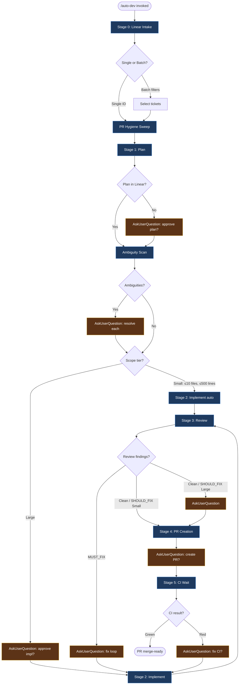

# Auto Dev Pipeline

Automated Linear→plan→implement→review→ship for development tickets.
Main session orchestrates. All work delegated to agents. Friction surfaced at checkpoints.
Scope determines which approvals are automatic vs manual.

**Arguments:** "$ARGUMENTS"

---

## Pipeline Flow



Checkpoints (amber) are automation gates — AUTO-SKIP for Small + Linear-authored plans, AskUserQuestion otherwise. See **Guard Matrix** below for the full rule set.

---

## Headless Mode

Pass `--headless` to run the pipeline with no interactive prompts. Every `AskUserQuestion` call is replaced by the deterministic action in the gate-collapse table below.

**Purpose:** autonomous orchestrator dispatch from `cw` (`mattwwarren/claude-workspace`). Issues cw#56–#59 are built against this contract and consume the structured output defined in the Appendix.

**Cross-repo spec:** [`claude-workspace/docs/headless-contract.md`](https://github.com/mattwwarren/claude-workspace/blob/main/docs/headless-contract.md) reformulates this section + the Appendix as a parser-implementer reference. This file (`commands/auto-dev.md`) is the producer source of truth; the spec doc is the link target for cw and any other consumer.

**Philosophy:** the human only sees the diff after the machine has done all deterministic cleanup it can. Two gates remain:
- Plan approval (large scope only) is the only "before work" gate.
- Review approval (large scope only) is the only "after work" gate.
Everything else runs to completion or exits with a structured error.

**Health aggregation rule:** If any spawned agent returns `On-spec confidence: LOW`, `Could work be incomplete?: MAYBE` or `YES`, or `Recommendation: EXIT_FOR_HUMAN_REVIEW`, downgrade the outcome:
- Small + clean review + all agents healthy → `shipped`
- Small + clean review + any degraded agent → downgrade to `review_pending_approval` (branch pushed, no PR)
- Large path is unchanged (already exits at S3), but include the full health summary in the result payload.
- When this rule downgrades the status, set `health.downgrade_applied: true` in the structured output. (Distinct from `health.fix_loop_escalated` which signals fix-loop escalation events — see Step 3b.5.)

**Agent spawn rule:** every agent prompt in headless mode MUST include BOTH the Friction Protocol block AND the Health Check block.

**Out of scope in headless mode:**
- Batch mode (multi-ticket selection) — stays interactive-only; `--headless` with batch filters is undefined behavior
- PR Hygiene Sweep (Steps H1, H2) — stays interactive-only
- Stage 5b feedback fix agent — stays interactive-only
- Resume / restart flag — tracked as a separate issue

### Gate-Collapse Table

All 19 rows define the deterministic headless action for every interactive gate in the pipeline:

> **Maintenance:** the `expected 2` and `hard-cap at 5` cycle values appear in 6 locations across this file. See the maintenance note in Step 3b.5 for the full sync list before editing the cycle-related rows here.

| Stage / gate | Headless behavior |
|---|---|
| S1 plan, plan in Linear | AUTO-SKIP plan-approval question (ambiguity scan still runs) |
| S1 plan, no Linear plan, small | Generate → AUTO-APPROVE (ambiguity scan still runs) |
| S1 plan, no Linear plan, large | Generate → EXIT `plan_pending_approval` (post to Linear, no branch) |
| S1 ambiguity scan, no ambiguities | AUTO-CONTINUE |
| S1 ambiguity scan, ambiguities found | EXIT `ambiguities_pending_resolution` (post ambiguity list to Linear as a comment, no branch) |
| S1 pre-flight finds ticket already satisfied | EXIT `no_op` (no branch, `next_actions: ["close_issue_as_completed"]`) |
| S1 scope-limit hit | EXIT `scope_exceeded` |
| S1 forbidden-area hit | EXIT `forbidden_area` |
| S2 impl checkpoint (any scope) | AUTO-CONTINUE — never gate |
| S2 BLOCK or 2x failure | EXIT `blocked` with `blocker.reason: "impl_failed"` |
| S3 review (any scope) | Always run reviewers |
| S3 MUST_FIX (any scope) | Run fix loop; expected 2 cycles, hard-cap at 5 |
| S3 fix-loop, Small + sparse fix (Step 3b.5 criteria all hold) | Skip re-review → S4. Append `"rereview_skipped_sparse"` to `friction_highlights` |
| S3 review clean / SHOULD_FIX, small | AUTO-CONTINUE → S4 |
| S3 review clean / SHOULD_FIX, large | EXIT `review_pending_approval` (post-fix-loop diff, branch pushed, no PR) |
| S3 MUST_FIX persists after 5 cycles | EXIT `blocked` with `blocker.reason: "review_blocked"` |
| S3 fix-loop cycle 3+ OR scope growth at any cycle | Append to `friction_highlights`, set `health.fix_loop_escalated: true`, continue |
| Any other agent BLOCK (Plan / prep-pr / etc.) | EXIT `blocked` with `blocker.reason: "agent_block"` |
| S4a merge gate (small only — large already exited) | EXIT `merge_gate_blocked` if prior pipeline PR open |
| S4b PR creation, small | AUTO-CREATE with auto-merge |
| S5 CI wait | AUTO-SKIP — return immediately after auto-merge enabled. CI watching = orchestrator concern |
| Trailing /schedule asks | suppress |

---

## Friction Protocol

Every agent prompt MUST end with this block verbatim:

```
FRICTION PROTOCOL — include this section at the END of your response:

## Friction Report
- **Level**: NONE | INFO | WARN | BLOCK
- **Scope**: N files changed, ~M lines
- **Assumptions**: [decisions you made without explicit guidance — if none, say NONE]
- **Deviations**: [anything done differently from plan/instructions — if none, say NONE]
- **Discoveries**: [unexpected findings: related bugs, dead code, schema surprises, scope creep risk — if none, say NONE]
- **Risks**: [shared code touched, interface changes, potential downstream breakage — if none, say NONE]

BLOCK level means you cannot proceed without user input. Explain what you need.
```

---

## Health Check Protocol

Every agent prompt in headless mode MUST ALSO end with this block, appended after the Friction Report:

```
## Health Check
- **Context usage**: <rough % or HIGH/MEDIUM/LOW>
- **On-spec confidence**: HIGH | MEDIUM | LOW
- **Shortcuts taken under pressure**: [list or NONE]
- **Could work be incomplete?**: NO | MAYBE | YES (explain)
- **Recommendation**: PROCEED | EXIT_FOR_HUMAN_REVIEW
```

The main session aggregates these reports per the rule documented in the Headless Mode section above. In interactive mode the block is optional but recommended.

---

## Guard Matrix

Two independent axes control approval automation.

**Axis 1 — Plan source (determines plan checkpoint):**

| Condition | Plan Checkpoint |
|-----------|----------------|
| Plan found in Linear issue (or issue description is sufficient) | AUTO-SKIP — pre-approved by authoring it |
| No plan / partial plan only | AskUserQuestion |

**Axis 2 — Scope tier (determines impl + review checkpoints):**

| Tier | Criteria |
|------|----------|
| **Small** | ≤10 files AND ≤500 lines AND no forbidden-area touches |
| **Large** | >10 files OR >500 lines OR touches forbidden areas |

| Checkpoint | Small Scope | Large Scope |
|------------|-------------|-------------|
| Implementation | AUTO-ACCEPT (log summary) | AskUserQuestion |
| Review (clean / SHOULD_FIX only) | AUTO-ACCEPT | AskUserQuestion |
| Review (MUST_FIX) | AskUserQuestion (always) | AskUserQuestion (always) |
| PR creation | AskUserQuestion (always) | AskUserQuestion (always) |

---

## Stage 0: Linear Intake

1. Parse `$ARGUMENTS`:
   - **Linear issue ID** (e.g., `GEN-1234`) → single-ticket mode, skip selection
   - **Filter flags** (`--cycle`, `--project`, `--label`, `--team`, `--state`, `--assignee`, `--priority`) → batch mode
   - **Free text** (no ID pattern, no flags) → use as description directly, no Linear lookup, no existing plan
   - **Mode flag** `--headless` → suppress all AskUserQuestion calls; apply gate-collapse table from the Headless Mode section for all downstream decision points. Independent of the input forms above (can combine with Linear ID, filters, or free text — though batch mode behavior in headless is undefined per the Headless Mode out-of-scope notes).

2. **Parse constraint flags** (used by `/auto-debt` alias):
   - `--scope-limit small` → reject tickets classified as Large
   - `--branch-prefix <prefix>` → override default `dev` branch prefix
   - `--forbidden <comma-separated areas>` → hard-reject tickets touching these areas

3. **Single-ticket mode:** Fetch issue via `get_issue`. Proceed to Stage 1.

4. **Batch mode:**
   - Call `list_issues` with provided filters. Apply defaults for omitted filters:
     - `state` defaults to `"Todo"` if not provided
     - `assignee` defaults to `"me"` if not provided
   - For each issue in the result:
     - Read description to check for existing plan content
     - Estimate scope hint from description keywords
   - Present a numbered list:
     ```
     Found N tickets matching filters:
      1. GEN-123: Fix login timeout [~Small, has plan]
      2. GEN-456: Refactor user service [~Large, no plan]
      3. GEN-789: Add retry logic [~Small, no plan]
     ```
   - **AskUserQuestion:** "Select tickets to process (e.g., '1,3' or 'all'), or 'abort':"
   - Build ordered queue from selection. Order matters — tickets process in the order specified.

---

## PR Hygiene Sweep (runs before each ticket)

Before starting work on a new ticket, check all open pipeline PRs for issues that need attention. This prevents PR backlog from accumulating while the pipeline is heads-down on new work.

**When:** At the start of each ticket in the queue (before Stage 1). Skip for the very first ticket (no prior PRs exist yet).

### Step H1: Scan Open Pipeline PRs

```bash
gh pr list --author @me --state open --json number,title,headRefName,reviewDecision,mergeable,mergeStateStatus
```

Filter for branches matching the pipeline's naming pattern (`<branch-prefix>/*`).

For each open pipeline PR, gather status:
```bash
gh pr checks <number> --json name,state,conclusion
gh api repos/{owner}/{repo}/pulls/<number>/reviews --jq '.[] | select(.state == "CHANGES_REQUESTED") | {user: .user.login, state: .state, body: .body}'
gh api repos/{owner}/{repo}/pulls/<number>/comments --jq '.[] | {user: .user.login, path: .path, line: .line, body: .body, created_at: .created_at}'
```

### Step H2: Report and Triage

**If all open PRs are healthy** (CI passing or pending, no changes requested, mergeable): Log "All N open PRs healthy" and proceed to Stage 1.

**If any PR needs attention:**

**AskUserQuestion:**
```
PR Hygiene Check — N open pipeline PRs:

PR #<A> (<title>): ✅ CI passing, awaiting merge
PR #<B> (<title>): ❌ CI failing — <failed check>
PR #<C> (<title>): 🔄 Changes requested by <reviewer>
  - <file>:<line> — "<comment>"
  - ...
PR #<D> (<title>): ⚠️ Merge conflicts with main

Options:
1. Fix all — address CI failures, review feedback, and conflicts before starting next ticket
2. Fix critical — fix CI failures and conflicts only (skip review feedback for now)
3. Skip — proceed to next ticket (handle PR issues later)
4. Cherry-pick — tell me which PRs to fix (e.g., "fix #B and #C")
```

- **Fix all / Fix critical / Cherry-pick** → For each PR being fixed:
  - **CI failure:** Spawn agent in that PR's branch to investigate and fix. Push. Wait 10m for CI (per Stage 5 protocol).
  - **Changes requested:** Surface full feedback, apply fixes, push, reply to comments. Wait 10m for CI.
  - **Merge conflicts:** Fetch main, merge, resolve conflicts, re-run quality gates, push. Wait 10m for CI.
  - After all fixes: re-scan to confirm health, then proceed to Stage 1.
- **Skip** → Proceed to Stage 1 for the next ticket.

**Note:** This sweep is intentionally lightweight — just API calls. The heavier fix work happens only when issues are found. The goal is to catch and clear PR debt early so it doesn't pile up.

### Quick Feedback Checks (stage boundaries)

In addition to the full hygiene sweep before each ticket, run a **quick feedback check** at natural pause points within a ticket's lifecycle — specifically between non-code-writing phases where we're waiting on agent results anyway:

- **After plan agent returns** (before Checkpoint 1)
- **After implementation agent returns** (before Checkpoint 2)
- **After review agents return** (before Checkpoint 3)

Quick check is lightweight — scan only, no fix:

```bash
gh api repos/{owner}/{repo}/pulls/<prior-pr-number>/reviews --jq '.[] | select(.state == "CHANGES_REQUESTED") | .user.login' 2>/dev/null
gh pr checks <prior-pr-number> --json state,conclusion --jq '.[] | select(.conclusion == "FAILURE")' 2>/dev/null
```

**If issues found:** Log a one-line notice: "⚠ PR #N has new feedback / CI failure — will address at next hygiene sweep or merge gate."

**Do NOT interrupt the current ticket's flow** for a quick check — just surface awareness. The user can choose to pause and address it, or let the pipeline continue to the next natural triage point (hygiene sweep or merge gate).

This keeps max feedback latency to roughly one pipeline stage (~minutes) rather than one full ticket (~could be much longer for large scope).

---

## Stage 1: Plan

For each ticket in the queue:

### Step 1a: Check for Existing Plan

1. **Linear tickets:** Read the issue description AND comments (via `get_issue` + `list_comments`). Look for content that constitutes an implementation plan — specifically:
   - File paths with described changes
   - Phased approach (tests + implementation)
   - Estimated scope (files/lines)
   - Sections titled "Plan", "Implementation Plan", "Approach", or similar
   - A clear, actionable description that specifies what to change and where (even without formal plan structure)

2. **Free text input:** No existing plan — proceed to Step 1b.

3. **Decision:**
   - **Plan found (sufficient):** Extract it. AUTO-SKIP plan approval entirely. Log: "Found existing plan on ticket — plan pre-approved." Proceed to scope classification.
   - **Partial plan found** (e.g., high-level approach but no file paths or phases): Note what exists, proceed to Step 1b with context.
   - **No plan found:** Proceed to Step 1b.

### Step 1b: Generate Plan (Agent)

Spawn a **Plan** agent (`subagent_type: "Plan"`, `run_in_background: true`):

**Prompt must include:**
- Ticket description / user description
- Any partial plan context from Step 1a (if applicable)
- Instruction to read CLAUDE.md and ARCHITECTURE.md
- Instruction to read actual model/schema definitions — never guess field names
- **Pattern discovery (required before proposing any new abstraction).** Before the plan adds a new endpoint, route, cache table, model, repository method, UI component, settings surface, strategy hook, or service class, the agent MUST grep the repo for sibling patterns that already solve a similar shape. The plan must include a `## Patterns Found` section with one entry per new abstraction proposed, in this format:
  ```
  ## Patterns Found

  - Proposed: <new thing being added, e.g. "POST /v1/widgets/{id}/preview endpoint">
    Searched for: <grep queries actually run, e.g. "grep -rn 'POST.*preview' --include='*.py'", "grep -rn 'cst_<billing>_' --include='*.py'">
    Found: <list of sibling patterns located, with file:line refs — or "no sibling pattern in tree">
    Decision: USE_EXISTING <name+path> | EXTEND_EXISTING <name+path> | NEW_PATTERN
    Justification (if NEW_PATTERN): <why no existing pattern fits — be specific>
  ```
  If the plan adds *no* new abstraction (pure bug fix, parameter tweak, copy edit), write `## Patterns Found\n\nN/A — no new abstraction proposed.` instead. The orchestrator validates this section is present and well-formed; a plan with new abstractions but no `Patterns Found` section is a friction-block (BLOCK level), not a warning.
  Common patterns worth grepping for, regardless of project: cache/reference tables, sibling endpoints with the same verb/resource shape, base-class hooks, shared UI components, settings/feature-flag surfaces, audit-log helpers.
- Instruction to produce a test-first plan:
  - Phase 1: Tests to write/update BEFORE implementation (for larger scope, integration tests run in isolation)
  - Phase 2: Implementation — specific file changes with paths
- List all files that will be modified with estimated line counts
- **Ambiguity pre-flight:** after the plan, append a section titled `## Ambiguities` listing anything in the ticket that you had to interpret without an explicit answer (file naming, behavior on edge cases, scope boundaries, role/auth assumptions, error handling defaults). Format each item exactly as the Product Manager Reviewer agent's Mode 1 output (question, plan's assumption, alternatives, why-it-matters, ticket quote). If you made no interpretive choices, write exactly `NO_AMBIGUITIES`. The main session will route these into Step 1c without re-spawning a separate agent.
- **Pre-flight verification:** instruction to read the targeted files / artifacts and check whether the requested change is already in the desired state. If ALL targeted changes are already applied (no plan-agent disagreement, no ambiguity), the agent MUST report this clearly under `**Discoveries**` in the friction report with the exact phrase `pre-flight: already satisfied` (verbatim, lowercase, including the colon) plus a per-artifact rundown showing the desired state was found. **The phrase is matched literally by the orchestrator** — paraphrases like "already done", "already in desired state", or "work complete" will NOT trigger the `no_op` exit and the pipeline will instead implement the (possibly empty) plan redundantly. The agent must reproduce the phrase exactly. If the situation is ambiguous or only partially satisfied, the agent must produce a normal plan covering the gap and NOT use the `pre-flight: already satisfied` phrase.
- The friction protocol block
- The following health check block verbatim:
  ```
  ## Health Check
  - **Context usage**: <rough % or HIGH/MEDIUM/LOW>
  - **On-spec confidence**: HIGH | MEDIUM | LOW
  - **Shortcuts taken under pressure**: [list or NONE]
  - **Could work be incomplete?**: NO | MAYBE | YES (explain)
  - **Recommendation**: PROCEED | EXIT_FOR_HUMAN_REVIEW
  ```

### Step 1c: Ambiguity Verification

After a plan is in hand (whether extracted from Linear or generated by the Plan agent), run an ambiguity scan against the ticket BEFORE proceeding to scope classification. This step runs in every case — including the auto-skip path where the plan was authored in Linear. A pre-approved plan is not the same as a plan free of ambiguity; the human authored it but may not have caught every interpretive gap.

**This step is non-negotiable.** Do NOT do an "inline scan" instead. Specifically, none of the following are valid reasons to skip the agent spawn:

| Rationalization | Why it's wrong |
|---|---|
| "Ticket is highly prescriptive — file paths, exact code, test cases" | Prescriptive tickets are the most dangerous: detail creates false confidence, and the implicit assumptions (edge cases, error handling defaults, what NOT to touch, scope boundaries) usually go unstated precisely because the author thought everything was covered. Ambiguity scan exists to surface those. |
| "User said move without pausing / don't ask questions" | That instruction governs clarifying questions to the user. The PM Reviewer runs **in background** and asks nothing of anyone. If it returns `NO_AMBIGUITIES`, no one is interrupted. The instruction does not authorize skipping background review steps. |
| "I can scan it faster myself" | The cost of the agent is small; the cost of a missed ambiguity is rework or a wrong implementation. Speed-over-quality during this step is exactly the trade-off the orchestrator is structured to prevent. |
| "Ticket is short / scope is small" | Small scope ≠ unambiguous scope. A one-line change can have multiple plausible interpretations. |

If you catch yourself drafting prose that explains *why* the agent isn't needed this time, that IS the signal — spawn it.

1. **Source the ambiguity list.**
   - If the Plan agent ran in Step 1b and emitted a `## Ambiguities` section, use that list directly — do NOT re-spawn an agent. Skip to step 2 below.
   - Otherwise (plan was extracted from Linear in Step 1a, not generated): you **MUST** spawn a **Product Manager Reviewer** agent (`subagent_type: "Product Manager Reviewer"`, `run_in_background: true`) in **ambiguity scan** mode. No inline shortcut is permitted regardless of how prescriptive or small the ticket appears.

   **Prompt must include:**
   - Mode declaration: `Mode: ambiguity scan`
   - The ticket: description + ALL comments in chronological order (via `get_issue` + `list_comments`), or the free-text description if no Linear ticket
   - The plan: full text, file list, phases
   - Instruction to output either `AMBIGUITIES — N items` (with the question format defined in the agent spec) or exactly `NO_AMBIGUITIES`
   - The friction protocol block
   - The Health Check block (verbatim from Step 1b)

2. Parse the agent's output.

   - **`NO_AMBIGUITIES`** → proceed to Step 1d (scope classification). Log: "Ambiguity scan: clean."
   - **`AMBIGUITIES — N items`** → present each ambiguity to the user via AskUserQuestion (one question per ambiguity, with the plan's current interpretation as the first / recommended option and the alternatives listed). Collect answers, append them as decision context to the plan, then proceed to Step 1d.

3. **Free-text tickets:** if no Linear ticket and no description was supplied, skip the ambiguity scan entirely (nothing to compare the plan against). Log: "Ambiguity scan: skipped (no ticket context)."

4. **Headless mode:**
   - `NO_AMBIGUITIES` → AUTO-CONTINUE to Step 1d.
   - `AMBIGUITIES` → EXIT `ambiguities_pending_resolution`. Post the ambiguity list to the Linear ticket as a comment (one numbered question per item, with the plan's current interpretation and the alternatives) and include the structured list in the result payload under `ambiguities`. The branch is NOT created. The cw orchestrator surfaces the questions to the human; once answered (either by updating the ticket description / comments or by re-invoking with explicit overrides), the pipeline can be re-entered.

### Step 1d: Scope Classification

From the plan (existing or generated), classify scope:

1. Count planned files and estimated line changes
2. Check if any planned files touch forbidden areas (migrations, auth/security core, CI/CD, shared base classes with 3+ consumers)
3. Classify:
   - **Small:** ≤10 files AND ≤500 lines AND no forbidden-area touches
   - **Large:** >10 files OR >500 lines OR touches forbidden areas

4. **Constraint enforcement** (if `--scope-limit small` is active):
   - If classified Large: **AskUserQuestion:** "Ticket <id> exceeds scope limit (estimated N files, ~M lines). Skip this ticket, or abort pipeline?"

5. **Constraint enforcement** (if `--forbidden <areas>` is active):
   - If plan touches any forbidden area: **AskUserQuestion:** "Ticket <id> touches forbidden area (<area>). Skip this ticket, or abort pipeline?"

### Checkpoint 1 (Plan Approval)

**If plan was auto-skipped** (existing plan found): Skip this checkpoint entirely.

**If plan was generated or built on partial:**

Present to user:
- Ticket summary
- Plan source (generated fresh / built on partial)
- File list + estimated scope (files/lines)
- Scope classification (Small / Large)
- Phase 1 test approach
- Phase 2 implementation approach
- Friction report highlights (skip if NONE)

**AskUserQuestion:** "Approve plan, adjust, or skip ticket?"

- **Approve** → proceed to Stage 2
- **Adjust** → re-plan with user's adjustments, re-present
- **Skip** → move to next ticket in queue

**Headless** (clauses are evaluated in order; first match wins): If plan agent reported `pre-flight: already satisfied` → EXIT `no_op` (see Step 1e) — this preempts every other clause below, including scope and forbidden-area rejections, since there is nothing to implement. Otherwise: if plan in Linear → AUTO-SKIP plan-approval question (ambiguity scan in Step 1c still runs and may exit `ambiguities_pending_resolution`). If plan generated + small → AUTO-APPROVE and proceed (Step 1c still gates on ambiguities). If plan generated + large → EXIT `plan_pending_approval` (post plan to Linear, no branch — ambiguity scan is bypassed since the human will see the plan and ambiguities together when reviewing the Linear post). If `--scope-limit small` rejects → EXIT `scope_exceeded`. If `--forbidden` rejects → EXIT `forbidden_area`.

### Step 1e: Pre-flight Already-Satisfied Check

Before posting the plan to Linear (Step 1f), check the plan agent's friction report for the exact phrase `pre-flight: already satisfied` under `**Discoveries**`. **Match literally** — case-insensitive substring match against the Discoveries body is acceptable, but do not infer the signal from paraphrases ("work already complete", "nothing to change", etc.). If the agent paraphrased and you suspect the intent, the safe action is to re-spawn the plan agent with a corrected prompt rather than guess. This signal means all targeted changes are already in the desired state and there is nothing to implement.

**If the signal is present:**
- Do NOT create or push a branch.
- Do NOT post a plan to Linear (the ticket is being closed, not implemented).
- In headless mode: EXIT immediately with `status: "no_op"`, `blocker: null`, `next_actions: ["close_issue_as_completed"]`, and `health.recommendation: "EXIT_FOR_HUMAN_REVIEW"` (a human still needs to close the ticket — the skill does not auto-close).
- In interactive mode: surface the agent's per-artifact rundown to the user and **AskUserQuestion:** "Plan agent reports the requested work is already in the desired state. Close ticket as completed, re-plan (in case the agent missed something), or skip?"

The `no_op` status is distinct from `blocked` + `agent_block`: "already satisfied" is a healthy outcome, not a failure that needs human attention. Routing it through `blocked` produces alerting noise once orchestrators (e.g. cw) act on the structured contract.

**If the signal is absent:** proceed to Step 1f.

### Step 1f: Post Plan to Linear

After plan is approved (or auto-skipped with existing plan), post the plan as a comment on the Linear issue (skip for free-text tickets). This documents the implementation approach on the ticket.

If Step 1c surfaced ambiguities AND the user resolved them (interactive path), include the resolved answers in the Linear comment under a `## Decisions` section. This preserves the trail of what was clarified and when, so the same questions don't get re-asked in a future re-run.

---

## Stage 2: Implement (Agent in Worktree)

Spawn a **general-purpose** agent (`isolation: "worktree"`, `run_in_background: true`):

**Prompt must include:**
- The approved plan (full text)
- Branch naming: `<branch-prefix>/<ticket-id-or-short-slug>` (default prefix: `dev`)
- **Branch freshness:** Before starting work, sync with latest main:
  ```bash
  git fetch origin main
  git merge origin/main
  ```
  If merge conflicts occur at this stage, report in friction as BLOCK — the worktree is starting from a conflicted state and cannot proceed.
- **Record the fork point** immediately after merging main — this is the exact commit the feature branch diverged from, used later for deterministic diffs:
  ```bash
  FORK_POINT=$(git merge-base origin/main HEAD)
  ```
  Include `FORK_POINT` in the friction report output. This value is immutable and must be used for all subsequent diff operations in the pipeline.
- Phase 1 instructions: write tests, run in isolation, confirm they FAIL
- Phase 2 instructions: implement fix, run tests again, confirm they PASS
- Post-implementation: `uv run ruff check --fix` on changed files, `uv run mypy .`
- Instruction to read model/schema definitions before writing code
- Instruction to use Read/Write tools for file operations, not Bash cp/mv/cat
- Instruction: if anything fails or surprises you, report it in friction — do NOT silently skip or suppress
- Instruction to stage and commit changes with a conventional commit message
- **Branch discipline (pre-commit and pre-push):** `isolation: "worktree"` provisions the worktree on an auto-generated session branch (e.g., `agent-<hash>`), NOT on `<branch-name>`. The agent MUST NOT assume the local branch matches the feature branch name. Before committing, run `git branch --show-current` and record the actual local branch in the friction report. Before pushing, do the same.
- **Instruction to push the branch to origin** after committing — use the explicit-refspec form so the local branch name (a session branch) does not need to match the remote feature branch:
  ```bash
  git push -u origin HEAD:refs/heads/<branch-name>
  ```
  Do NOT use `git push -u origin <branch-name>` (the short form): when the local branch is `agent-<hash>`, that form either fails or pushes the wrong ref. The `HEAD:refs/heads/<branch-name>` form pushes whatever the agent committed to the named feature branch on origin regardless of the local branch name. After pushing, verify with `git rev-parse origin/<branch-name>` and confirm it matches `git rev-parse HEAD`. This is critical — subsequent stages (fix loop, PR creation) depend on the branch being on origin rather than locked inside a stale isolation worktree that new subagents cannot reach.
- Instruction to include the final pushed commit SHA, the local branch name (from `git branch --show-current`), and the push confirmation (`origin/<branch-name>` SHA) in the friction report
- The friction protocol block
- The following health check block verbatim:
  ```
  ## Health Check
  - **Context usage**: <rough % or HIGH/MEDIUM/LOW>
  - **On-spec confidence**: HIGH | MEDIUM | LOW
  - **Shortcuts taken under pressure**: [list or NONE]
  - **Could work be incomplete?**: NO | MAYBE | YES (explain)
  - **Recommendation**: PROCEED | EXIT_FOR_HUMAN_REVIEW
  ```

### Checkpoint 2 (Implementation Approval)

**Small scope → AUTO-ACCEPT.** Log to user:
- Worktree path and branch name
- **Fork point SHA** (the merge-base recorded after syncing with main — required for all subsequent diffs)
- **Pushed commit SHA** (verify the agent actually pushed to origin — if not, escalate as BLOCK; the fix loop and PR creation both depend on this)
- Files changed with line counts
- Test results (pass/fail counts)
- Lint + type check results
- Friction report (highlight WARN/BLOCK — BLOCK still stops regardless of scope)

**Large scope → AskUserQuestion:**
- Present same information as above
- "Implementation complete for <ticket-id>. Approve for review, adjust, or abort?"

**Headless:** AUTO-CONTINUE always (never gate, regardless of scope). On BLOCK or 2x failure → EXIT `blocked` with `blocker.reason: "impl_failed"`.

### Implementation Failure Escalation

If any agent returns friction level **BLOCK**:
- Surface the blocker immediately via AskUserQuestion
- Do NOT proceed to next stage

If implementation agent fails tests/lint/mypy after 2 attempts:
- Surface the failure details via AskUserQuestion
- "Continue manually from worktree, skip ticket, or abort pipeline?"
- Do NOT loop indefinitely

---

## Stage 3: Review (Agents)

### Step 3a: Spawn Review Agents

**Small scope:** Spawn these reviewers:
- Code Quality Reviewer (`subagent_type: "Code Quality Reviewer"`)
- SysAdmin Reviewer (`subagent_type: "SysAdmin Reviewer"`)
- Data Safety Reviewer (`subagent_type: "Data Safety Reviewer"`) — only when the diff mutates persisted state (any DB write, external-system write, or `SENSITIVE_HITS` non-empty); skip on doc/config/style-only diffs
- Product Manager Reviewer (`subagent_type: "Product Manager Reviewer"`, Mode 2 — spec compliance)

**Large scope:** Spawn full reviewer set based on file categories (per `/review` command patterns):
- Code Quality (always)
- Architecture (any code changed)
- Test Quality (test files changed or testable code without test changes)
- Performance (Python DB/API/service layer)
- API Contract (both backend + frontend changed)
- Deployment (infra files changed)
- SysAdmin / Scope (always)
- Data Safety (always when persisted-state mutation is present)
- Product Manager (always — Mode 2 spec compliance)

All reviewers run with `run_in_background: true`.

**Sandbox warning**: reviewer subagents spawned without `isolation: "worktree"` may have inconsistent file access depending on sandbox state — sometimes reads work, sometimes they're denied. The safest pattern is to **inline the full diff directly in each reviewer's prompt** (captured from the main session). This lets reviewers evaluate purely from the prompt content without needing filesystem access. Do not assume read access "just works."

**Before spawning reviewers, load project-specific extensions** (both optional, both forwarded into every reviewer prompt):
- `.claude/review-extras.md` at the project root — free-form prose rubrics the project owner wants every reviewer to apply on top of the global agent specs. Read verbatim. If absent, set `PROJECT_RUBRICS = null`.
- `.claude/sensitive-files.yml` at the project root — manifest of high-blast-radius paths. If present, diff the changed-files list against the manifest's globs. For every match, capture `(file_path, reason, category)` into `SENSITIVE_HITS`. If absent or no matches, set `SENSITIVE_HITS = []`.

**Every reviewer prompt must include:**
- **The full diff inlined as text in the prompt.** Use the fork point SHA from Checkpoint 2 for a deterministic diff:
  ```bash
  git diff <FORK_POINT>...<branch>
  ```
  Do NOT use `origin/main` here — it may have advanced since the worktree was created. The fork point is the exact commit the feature branch diverged from.
  For small scope, include the whole diff. For large scope, you may summarize the non-critical files but always inline the primary ones.
- Changed file list
- **`PROJECT_RUBRICS` block** (inline verbatim if non-null, omit the section entirely if null):
  ```
  ## Project-Specific Rubrics

  <verbatim contents of .claude/review-extras.md>
  ```
- **`SENSITIVE_HITS` block** (inline if non-empty, omit if empty):
  ```
  ## Sensitive Files Touched

  This diff modifies files the project flagged as high blast-radius. Apply maximum scrutiny when reviewing these paths — unintended scope changes, missing auth checks, new external write paths, error handling gaps, cross-org/tenant data leakage, destructive defaults.

  - <file_path> — <category>: <reason>
  ```
- **Business Context** (inlined verbatim — required for every reviewer, not just the Product Manager Reviewer):
  - Ticket ID and title
  - Ticket description (full text)
  - All Linear comments in chronological order (via `list_comments`) — decisions often live in comments and supersede the description
  - Step 1c ambiguity resolutions (if any were collected) — the answers the human gave to ambiguous questions
  - For free-text tickets: the user-supplied description, marked as `[free-text, no Linear ticket]`
- Review focus areas:
  1. Does the change address the actual ticket? (PM Reviewer owns this lens; other reviewers flag only if blatantly obvious from their own domain.)
  2. Did implementation stay within plan scope? Flag creep.
  3. Do tests validate meaningful behavior?
  4. Could this break anything downstream?
  5. Debug artifacts left in? (`print()`, `breakpoint()`, `pdb`, `ic()`)
- **Product Manager Reviewer only:** prepend `Mode: spec compliance` to the prompt (Mode 2 per the agent spec). Other reviewers do not need a mode declaration.
- Standard output rules: MUST_FIX / SHOULD_FIX only, no praise, NO_ISSUES if clean
- The friction protocol block
- The following health check block verbatim:
  ```
  ## Health Check
  - **Context usage**: <rough % or HIGH/MEDIUM/LOW>
  - **On-spec confidence**: HIGH | MEDIUM | LOW
  - **Shortcuts taken under pressure**: [list or NONE]
  - **Could work be incomplete?**: NO | MAYBE | YES (explain)
  - **Recommendation**: PROCEED | EXIT_FOR_HUMAN_REVIEW
  ```

### Checkpoint 3 (Review Approval)

Consolidate review results: deduplicate, sort by severity, group by file.

**Small scope + (NO_ISSUES or SHOULD_FIX only) → AUTO-ACCEPT.** Log:
- Review outcome: "Review clean" or "N SHOULD_FIX items noted — auto-accepted per small scope"
- List SHOULD_FIX items for transparency

**Small scope + MUST_FIX → AskUserQuestion:**
- Present MUST_FIX findings (with file, line, description, suggested fix)
- Present SHOULD_FIX findings if any
- "MUST_FIX findings block shipping. Fix and re-review, skip fixes and ship anyway, skip ticket, or abort?"

**Large scope (any result) → AskUserQuestion:**
- Present full consolidated review report
- If MUST_FIX: "Fix these issues and re-review, or abort?"
- If clean or SHOULD_FIX only: "Review complete. Proceed to PR creation?"

**Headless:** Always run reviewers. MUST_FIX → run fix loop (expected 2 cycles, hard-cap at 5; cycles 3+ or scope growth append to `friction_highlights` and set `health.fix_loop_escalated: true`). Clean/SHOULD_FIX + small → AUTO-CONTINUE to S4. Clean/SHOULD_FIX + large → EXIT `review_pending_approval`. MUST_FIX persists after 5 cycles → EXIT `blocked` with `blocker.reason: "review_blocked"`.

### Step 3b: Fix Loop (when MUST_FIX needs fixing)

**Important**: you cannot attach a new subagent to the original implementation worktree. Subagents spawned without `isolation: "worktree"` inherit the main session's sandbox, which typically does not include other worktrees. `isolation: "worktree"` always creates a *new* worktree, not an attachment to an existing one. The correct pattern is **push-then-recheckout**.

Prerequisite: the implementation branch must already be on origin. Step 2's Implementation agent should have pushed per its instructions — if not, escalate BLOCK before starting the fix loop.

1. Remove the stale implementation worktree and the local branch ref from the main session (the branch still exists on origin):
   ```bash
   git worktree remove --force <impl-worktree-path>
   git branch -D <branch-name>  # local only; origin still has it
   ```

2. Spawn the fix agent with `isolation: "worktree"` and `run_in_background: true`. The agent's **first actions** must be:
   ```bash
   git fetch origin
   git checkout -b <branch-name> origin/<branch-name>
   git log --oneline -1  # verify at expected impl commit

   # Refresh with latest main so the fix lands on top of upstream moves.
   # Failure mode avoided: a sibling PR (e.g. another ticket in this same
   # pipeline run) may have merged to main AFTER Step 2 pushed. Without
   # this merge, subsequent pushes ship a branch that's silently missing
   # commits from main — CI passes because it runs branch-HEAD, not the
   # branch-merged-with-main state.
   git merge origin/main --no-edit
   ```
   If merge conflicts occur → BLOCK with file list. Do not force.

3. Agent fixes MUST_FIX issues, re-runs quality gates, creates a NEW commit on top (do NOT amend), and pushes to origin using the explicit-refspec form (`git push origin HEAD:refs/heads/<branch-name>`) — defensive form, robust against any local branch rename even after the `git checkout -b <branch-name> origin/<branch-name>` in step 2 above. After pushing, verify with `git rev-parse origin/<branch-name>` matching `git rev-parse HEAD`. The fix-loop agent's prompt must end with both the Friction Protocol block and the following Health Check block verbatim:
   ```
   ## Health Check
   - **Context usage**: <rough % or HIGH/MEDIUM/LOW>
   - **On-spec confidence**: HIGH | MEDIUM | LOW
   - **Shortcuts taken under pressure**: [list or NONE]
   - **Could work be incomplete?**: NO | MAYBE | YES (explain)
   - **Recommendation**: PROCEED | EXIT_FOR_HUMAN_REVIEW
   ```

   The fix-loop agent's prompt must ALSO instruct: "If your fix touches any file outside the original Stage 1 approved plan's file list, OR if your changes push the diff into Large tier (>10 files OR >500 lines OR a forbidden area), report this in the friction report under a new bullet `**Scope growth**: [list affected files / explain tier change]`. The main session uses this to decide escalation."

4. **Sparse-feedback gate, then re-run review.** Before re-running review, check whether the cycle qualifies for the sparse-feedback skip. The fix-then-rereview cycle is NOT mandatory when initial feedback was sparse and the fix is small relative to the original change.

   **Skip re-review when ALL of the following hold (Small scope only):**
   - Scope tier was **Small** at Stage 1c, AND no scope growth was flagged in the fix-loop friction report (still Small)
   - Initial review produced ≤2 MUST_FIX items
   - Fix-loop diff is small relative to the original implementation diff — judgment call, no hard line ceiling. A 2-line touch on a 50-line PR is sparse; a rewrite of half the implementation is not. Proportionality is what matters.
   - Fix did not touch files outside the original Stage 1 plan's file list
   - No SHOULD_FIX items adjacent to the MUST_FIX areas were left unaddressed in a way that warrants a second look

   When skipping: log `Skipping re-review — Small scope, sparse fix (<N MUST_FIX> resolved, fix diff small relative to original). Proceeding to Stage 4.`, document the decision in the friction report under `**Re-review skipped**`, and jump directly to Stage 4.

   When in doubt, run re-review. The skip is for unambiguously small fixes only.

   **Headless:** apply the same criteria deterministically. If all conditions hold, skip re-review and proceed to S4 AUTO-CREATE; append `"rereview_skipped_sparse"` to `friction_highlights`. If any condition is uncertain, run re-review.

   **Otherwise, re-run review agents (same set).** Pass the updated full diff (using the same fork point SHA) and the fix-commit diff inlined in each reviewer's prompt (see Step 3a sandbox warning). Do NOT rely on reviewers reading files from disk. Each re-spawned reviewer prompt MUST include both the Friction Protocol block and the Health Check block, identical to the initial Step 3a spawn.

5. **Cycle budget:** 2 cycles is the expected baseline. If MUST_FIX persists past cycle 2, the loop may continue with escalation visibility, hard-capped at 5 total cycles. Escalation behavior differs between modes — see below.

   **Escalation triggers** (any of these counts as "an escalation event"):
   - Cycle 3, 4, or 5 entered (i.e., MUST_FIX persisted past the expected 2)
   - Fix-loop diff touches files outside the original Stage 1 approved plan's file list
   - Fix-loop diff promotes scope tier from Small → Large (file count > 10 OR line count > 500 OR forbidden area touched)

   The fix-loop agent's friction report MUST flag scope growth explicitly so the main session can decide whether the cycle counts as an escalation event. Do not let the agent silently grow scope.

   **Interactive — on each escalation event:** log a one-line notice to the user describing the trigger (e.g., `⚠ Fix loop entered cycle 3 (expected baseline is 2)` or `⚠ Fix loop cycle 2 grew scope outside plan: <files>`). Do NOT block on AskUserQuestion for these — the user can stop the pipeline between agent dispatches after seeing the notice, and the cycle-5 hard gate provides the final decision point. This is a deliberate trade-off: the prior spec gated at cycle 2; the current spec exchanges that early hard gate for reduced prompt fatigue, accepting that interactive cycles 3-4 will run with notice-only visibility rather than gating.

   **Headless — on each escalation event:** append a string to `friction_highlights` (e.g., `"fix_loop_cycle_3_entered"`, `"fix_loop_scope_growth: <files>"`) AND set `health.fix_loop_escalated: true` in the structured output payload. Continue the loop without any AskUserQuestion. (`health.fix_loop_escalated` is distinct from `health.downgrade_applied`, which is set only by the Headless Mode health aggregation rule for confidence-driven status downgrades.)

   **Hard exit (cycle 5 failed to clear MUST_FIX) — applies in both modes:**
   - **Interactive:** AskUserQuestion: "MUST_FIX issues persist after 5 fix cycles: [details]. Continue manually from worktree, skip ticket, or abort pipeline?"
   - **Headless:** EXIT `blocked` with `blocker.reason: "review_blocked"`. The `friction_highlights` field will contain the per-cycle escalation notes from cycles 3–5; the human reviewer sees them in the structured output.

   > **Maintenance note:** the cap values (`expected 2`, `hard-cap at 5`) appear in 6 locations: this Step 3b.5 (multiple), the Checkpoint 3 Headless callout, the gate-collapse table rows for `S3 MUST_FIX`, `S3 MUST_FIX persists after 5 cycles`, and `S3 fix-loop cycle 3+`, and the `blocker.reason` table description for `review_blocked`. If you tune either value, update all locations atomically.

**Fallback — direct execution**: If the isolation fix agent also hits sandbox failures (Read/Write/Bash denied inside its own new worktree — this has been observed), the main session can apply the fix directly from its own worktree:

```bash
# From the main session's worktree
git fetch origin <branch-name>
git checkout -b <branch-name> origin/<branch-name>   # or git checkout <branch-name> if already local
git merge origin/main --no-edit                      # refresh with main (see Step 3b.2 rationale)
# apply edits via Read/Edit/Write tools
# run quality gates
git add -- <changed files>
git commit -m "..."
git push origin HEAD:refs/heads/<branch-name>        # explicit refspec — robust if local branch was renamed
test "$(git rev-parse origin/<branch-name>)" = "$(git rev-parse HEAD)"  # verify the push landed
git checkout <original-branch>   # restore main session state
```

Direct execution is slower than delegation but guaranteed to work. Use it as a last resort when two subagent attempts have failed due to sandbox issues.

---

## Stage 4: PR Creation (Merge-Gated)

### Step 4a: Merge Gate Check

Before creating any PR, check for open PRs from this pipeline:

```bash
gh pr list --author @me --state open --json number,title,headRefName,mergeable,mergeStateStatus
```

Filter results for branches matching the pipeline's naming pattern (`<branch-prefix>/*`).

**If open PR found from this pipeline:**

Gather its status for the user:
```bash
gh pr checks <number> --json name,state,conclusion
gh pr view <number> --json state,mergeable,mergeStateStatus,reviewDecision
```

**AskUserQuestion:**
```
PR #<N> (<title>) is still open. The pipeline waits for merge before creating the next PR.

Status:
- CI: <passing / failing / pending>
- Reviews: <approved / changes requested / pending>
- Mergeable: <yes / no — conflicts>

Options:
1. Wait — say "continue" when the PR is merged
2. Force — create this PR anyway (parallel PRs)
3. Fix — address CI failures or merge conflicts on that PR first
4. Abort — stop pipeline processing
```

- **Wait** → Pause. When user says "continue", re-check PR status. If merged, proceed. If still open, re-ask.
- **Force** → Proceed with PR creation despite open PR. **Stacked PRs are always created as DRAFTS** so they cannot accidentally merge ahead of the bottom of the stack. `/review-monitor` promotes them to ready when the parent (oldest open pipeline PR) merges. The pipeline will continue to track the new PR for merge gating on subsequent tickets — meaning a stack of 3 still leaves later tickets gated on the bottom PR.
- **Fix** → Enter fix mode for the prior PR:
  - If CI failing: spawn agent in that branch's worktree to fix, push
  - If merge conflicts: fetch main, merge, resolve conflicts, push
  - If changes requested: enter Step 5b feedback handling for that PR
  - After fix, re-check status and re-present options
- **Abort** → Stop pipeline, summarize state

**If no open PR from this pipeline:** Proceed immediately.

**Headless:** (Small only — large already exited at S3.) If prior pipeline PR open → EXIT `merge_gate_blocked`. If no open PR → proceed.

### Step 4b: Pipeline-Level PR Approval

Present the ship summary to the user before delegating execution. This preserves the pipeline's scope-aware approval gate (scope was classified in Stage 1c and review just completed in Stage 3) — the underlying `/ship-it` is per-project and may not re-ask.

**AskUserQuestion:**
```
Ready to ship PR for <ticket-id>: <title>

Branch: <branch-prefix>/<ticket-id>
Scope: N files changed, ~M lines (<Small|Large>)
Review: <clean / N SHOULD_FIX noted / MUST_FIX fixed>
Tests: all passing
Quality gates: clean (from Stage 2)

Create PR via /prep-pr + /ship-it?
```

- **Yes** → proceed to Step 4c
- **No / Abort** → Stop, report worktree path for manual pickup

**Headless:** AUTO-CREATE PR with auto-merge enabled (skip this AskUserQuestion entirely; go directly to Step 4c).

### Step 4c: Delegate to /prep-pr

Spawn a **general-purpose** agent scoped to the implementation worktree. The agent invokes `/prep-pr` which handles: sync-with-main (+ conflict handling), quality gate detection + re-run, and ship-it delegation (per-project PR creation conventions, branch naming, CI setup).

**Why delegate:**
- `/prep-pr` delegates to per-project `.claude/commands/ship-it.md` which knows repo-specific PR conventions (template, labels, reviewers, base branch, CI bootstrap) that the pipeline shouldn't hardcode.
- Sync-with-main and quality-gate-rerun logic live in one place instead of being duplicated between `/auto-dev` Stage 4b and `/prep-pr` Step 1/7.
- PR monitor registration is handled by `/prep-pr` Step 9.

**Worktree mechanic:** `/prep-pr` operates in `cwd`. The impl worktree is not the main session's cwd. The safer path is to spawn with `isolation: "worktree"` and have the agent re-checkout the feature branch from origin (same push-then-recheckout pattern as Stage 3b fix loop) before invoking `/prep-pr`.

**Agent prompt must include:**
- Branch name, fork point SHA (from Checkpoint 2), and ticket ID
- Instruction to re-checkout the branch from origin AND refresh with main:
  ```bash
  git fetch origin
  git checkout -b <branch-name> origin/<branch-name>

  # Refresh with latest main — catches any upstream commits that landed
  # between the last fix push and now. Required even though /prep-pr
  # also merges main, because /prep-pr runs once; this is belt-and-
  # suspenders for pipelines that push many commits across fix rounds.
  git merge origin/main --no-edit
  ```
  If conflicts → BLOCK with file list; do NOT force.
- Instruction to invoke `/prep-pr --skip-review --base main` via the Skill tool. **If the user chose Force at Step 4a (stacking onto an open pipeline PR), append `--draft`** so `/prep-pr` passes it through to the project's `/ship-it` (`/prep-pr` Step 8 already supports `--draft` pass-through). The PR must be a draft until the parent merges.
  - `--skip-review` is required: Stage 3 already ran scope-aware review with the full reviewer set. `/prep-pr`'s own review pass is thinner and would double up.
- **Required deliverable:** the JSON output of `${CLAUDE_PLUGIN_ROOT}/scripts/prep_pr_finalize.py verify --require-automerge --json`, run from the worktree after `/prep-pr` returns. The friction report MUST include this JSON verbatim. Do NOT summarize or paraphrase it — paste it.
- Instruction: if `/prep-pr` aborts (no project `/ship-it`, merge conflicts, gate failures), escalate as BLOCK with the specific cause — do NOT fall back to inline `gh pr create`
- The friction protocol block
- The following health check block verbatim:
  ```
  ## Health Check
  - **Context usage**: <rough % or HIGH/MEDIUM/LOW>
  - **On-spec confidence**: HIGH | MEDIUM | LOW
  - **Shortcuts taken under pressure**: [list or NONE]
  - **Could work be incomplete?**: NO | MAYBE | YES (explain)
  - **Recommendation**: PROCEED | EXIT_FOR_HUMAN_REVIEW
  ```

**Main-session re-verification (do not skip):** After the subagent returns, re-run finalize from the impl worktree (using the worktree's git context — either `cd <worktree>` or `git -C <worktree>`):

```bash
${CLAUDE_PLUGIN_ROOT}/scripts/prep_pr_finalize.py verify --require-automerge --require-monitor --json
```

Required: parse the JSON. `status` must be `"ok"` and `pr_number` must be non-null before proceeding to Step 4d. If either fails, treat the subagent return as a lie — report the failed checks to the user via AskUserQuestion: "Subagent claimed ship complete but finalize failed (<failed-checks>). Re-run /prep-pr in the worktree, skip ticket, or abort pipeline?"

**If the agent returns BLOCK due to "no project `/ship-it`":** The project hasn't been set up for automated PR creation. AskUserQuestion: "Project has no `.claude/commands/ship-it.md`. Create one manually and resume, skip this ticket (leave branch pushed), or abort pipeline?"

### Step 4d: Post-Ship Pipeline Bookkeeping

After `/prep-pr` returns with a PR number:

1. **Enable auto-merge:** `gh pr merge <pr-number> --auto --squash`. GitHub allows enabling auto-merge on a draft PR — the merge won't trigger until the PR is marked ready (which `/review-monitor` does when the parent in the stack merges) AND CI passes. So enable it unconditionally here.
2. **Post to Linear:** Comment on the issue with PR link (skip for free-text tickets). For drafts, note in the comment: "Created as draft — stacked behind PR #<parent>; will auto-promote to ready when parent merges."
3. **Store pipeline state:** Record PR number, branch, ticket ID for the merge gate check in Step 4a of the next ticket
4. **Proceed to Stage 5** (CI Wait)

Note: monitor registration happens inside `/prep-pr` Step 9 — do NOT re-register here.

---

## Stage 5: CI Wait

After every push (PR creation or fix push), wait up to 10 minutes for CI to complete.

### Step 5a: Wait for CI (10 minutes max)

```bash
# Poll every 30 seconds for up to 10 minutes
gh pr checks <number> --watch --fail-fast 2>/dev/null
# If --watch not available, poll manually:
# Loop: gh pr checks <number> --json name,state,conclusion
# Exit when: all checks conclude, or 10 minutes elapsed
```

**If all checks pass within 10 minutes:** Log "CI passing" and proceed to Step 5b.

**If any check fails:**

**AskUserQuestion:**
```
CI failed on PR #<N> (<title>):

<failed check name>: <conclusion>
<failure details via: gh pr checks <number> --json name,state,conclusion,detailsUrl>

Options:
1. Fix — I'll investigate and push a fix (triggers another 10m CI wait)
2. Ignore — proceed to next ticket (auto-merge stays pending)
3. Abort — stop pipeline
```

- **Fix** → Spawn agent in the worktree to investigate CI failure, apply fix, push to branch. Loop back to Step 5a for the new push. Max 2 fix attempts, then escalate.
- **Ignore** → Proceed (user handles CI manually)
- **Abort** → Stop pipeline

**If checks still pending after 10 minutes:** Log "CI still running after 10m — proceeding. Auto-merge will complete when CI passes." Proceed to Step 5b.

**Headless:** AUTO-SKIP entire Stage 5 — return immediately after auto-merge is enabled in Step 4d. Do not poll CI; do not run Step 5b feedback handling.

### Step 5b: Initial Review Feedback Check

Check for early review comments (reviewers may be fast, or may have been tagged for auto-review):

```bash
gh api repos/{owner}/{repo}/pulls/<number>/reviews --jq '.[] | select(.state != "COMMENTED" and .state != "APPROVED") | {user: .user.login, state: .state, body: .body}'
gh api repos/{owner}/{repo}/pulls/<number>/comments --jq '.[] | {user: .user.login, path: .path, line: .line, body: .body}'
```

**If no reviews or only APPROVED/COMMENTED:** Log "No review feedback requiring action" and proceed.

**If CHANGES_REQUESTED found:**

**AskUserQuestion:**
```
PR #<N> has review feedback:

Reviewer: <username> — Changes Requested
<review body summary>

Inline comments:
- <file>:<line> — "<comment body>" (<username>)
- ...

Options:
1. Address — I'll fix the requested changes and push updates (triggers 10m CI wait)
2. Skip — proceed to next ticket (you'll address feedback manually)
3. Discuss — I'll draft reply comments for your review before posting
```

- **Address** → Spawn agent in the worktree. Agent reads all review comments, applies fixes, pushes to branch. Post a reply to each addressed comment summarizing the fix. Loop back to Step 5a for CI wait on the new push.
- **Skip** → Proceed to next ticket
- **Discuss** → Draft reply comments for each piece of feedback. Present drafts to user via AskUserQuestion before posting. Post approved replies via `gh api`.

### Step 5c: Continue to Next Ticket

1. If more tickets in queue: loop back to **PR Hygiene Sweep** (top of ticket loop) for the next ticket.
2. If no more tickets: proceed to Pipeline Summary.

---

## Error Recovery

At any failure point, present options via **AskUserQuestion:**

1. **Skip ticket** — move to next ticket, leave partial work (worktree, branch) for manual pickup
2. **Retry** — re-enter pipeline at the failed stage with existing state preserved
3. **Abort pipeline** — stop all processing

On skip or abort, report:
- What was completed
- Worktree path and branch if partial work exists
- Don't clean up worktrees — user may want the work

---

## Escalation

If any agent returns friction level **BLOCK**:
- Surface the blocker immediately via AskUserQuestion
- Do NOT proceed to next stage
- "Resolve this manually and resume, skip ticket, or abort pipeline?"

**Headless:** EXIT `blocked` with `blocker.reason: "agent_block"`. Populate `blocker.stage` with the stage that returned BLOCK and `blocker.details` with the agent's BLOCK message verbatim. This applies to BLOCKs from any agent NOT already covered by S2 (impl) or S3 fix-loop exit conditions — e.g., the Plan agent or the /prep-pr agent. (Stage 5b runs only in interactive mode per the Headless Mode out-of-scope notes; it is not reachable here.) Do NOT surface AskUserQuestion.

---

## Pipeline Summary (on completion or abort)

Print:
- Tickets completed (with PR numbers/URLs)
- Tickets failed (with stage and error summary)
- Tickets skipped
- Total PRs created
- Total files and lines changed across all tickets

### Fresh-Session Boundary (interactive only)

After printing the summary, append this reminder verbatim:

```
─────────────────────────────────────────────────────────
This auto-dev session is complete. If your next ask is **net-new work**
(new ticket, new investigation, new feature, debug fork on something
unrelated to the PRs above), strongly prefer a fresh session:

  1. Run `/handoff` to capture state
  2. Exit this session
  3. Start a new one with the handoff for context

Why: extended auto-dev sessions accumulate context that biases the model
toward the prior work's framing. Net-new work — especially debugging —
goes deeper and faster in a clean session.

Continue here only for: follow-ups on the PRs just shipped, hygiene
work on those branches, or thin clarification questions.
─────────────────────────────────────────────────────────
```

If the user's next prompt looks like net-new work despite this reminder (new ticket ID, unrelated bug, new feature description), surface the boundary again before acting: "That looks like net-new work — recommend `/handoff` and a fresh session. Proceed here anyway?" Then wait for confirmation. Do not silently continue.

**Headless:** Suppress this reminder block AND any trailing `/schedule` offers in headless output.

---

## Scope Tier Evolution

These thresholds determine guard levels, not rejection. Tune as trust grows:

| Version | Small Tier Ceiling | Forbidden Areas (auto-escalate to Large) |
|---------|-------------------|------------------------------------------|
| v1 (current) | 10 files, 500 lines | migrations, auth/security, CI/CD, shared bases (3+ consumers) |
| v2 (future) | 15 files, 800 lines | migrations, auth/security |
| v3 (future) | 25 files, 1500 lines | migrations |

---

## Appendix: Structured Output

In headless mode, after all pipeline logic completes, emit a sentinel-delimited JSON block as the final lines of stdout. The narrative friction reports remain above (still useful for tmux scrollback / post-mortem); this block is the parsing contract for `cw`.

```
<<<AUTO_DEV_RESULT
{
  "schema_version": 2,
  "ticket_id": "GEN-1234",
  "status": "shipped",
  "stage_reached": "stage5_post_create",
  "scope": {
    "tier": "small",
    "files": 3,
    "lines_estimate": 42,
    "lines_actual": 47,
    "forbidden_touched": false
  },
  "plan_source": "linear_existing",
  "branch": "dev/gen-1234-fix-login",
  "worktree_path": "/path/to/.cw/wt/abc/your-branch-name",
  "fork_point_sha": "abc1234",
  "commits": ["sha1", "sha2"],
  "pr": {
    "number": 42,
    "url": "https://github.com/.../pull/42",
    "auto_merge": true,
    "base": "main"
  },
  "review": {"must_fix_initial": 0, "should_fix": 1, "fix_cycles_used": 0},
  "health": {
    "lowest_agent_confidence": "MEDIUM",
    "any_incomplete_risk": false,
    "shortcuts": [],
    "recommendation": "PROCEED",
    "downgrade_applied": false,
    "fix_loop_escalated": false
  },
  "friction_highlights": [],
  "ambiguities": [],
  "blocker": null,
  "prior_pr_warnings": [],
  "next_actions": []
}
AUTO_DEV_RESULT>>>
```

### Status Enum (closed)

| Status | Meaning |
|---|---|
| `shipped` | PR created with auto-merge enabled; CI wait skipped |
| `no_op` | Stage 1 pre-flight verification found all targeted changes already in the desired state; no branch created; `next_actions: ["close_issue_as_completed"]`. Distinct from `blocked` — this is a healthy outcome, not a failure |
| `plan_pending_approval` | Large scope — plan generated and posted to Linear; no branch created; awaiting human approval |
| `ambiguities_pending_resolution` | Plan was clear enough to proceed by tier rules, but the Step 1c ambiguity scan surfaced clarifying questions; posted to Linear; no branch created; awaiting human answers |
| `review_pending_approval` | Large scope — fix loop complete, branch pushed, no PR; awaiting human review approval |
| `merge_gate_blocked` | Small scope — prior pipeline PR still open; cannot create next PR until gate clears |
| `scope_exceeded` | `--scope-limit small` rejected a Large ticket before impl started |
| `forbidden_area` | `--forbidden` constraint matched a planned file; ticket rejected before impl started |
| `blocked` | Unrecoverable error mid-pipeline; see `blocker` field for details |

### `blocker.reason` Values

When `status: "blocked"`, the `blocker.reason` field carries one of:

> **Maintenance:** the `review_blocked` row references the `5`-cycle hard cap. If you tune cap values, see the maintenance note in Step 3b.5 for the full sync list.

| Reason | Meaning |
|---|---|
| `impl_failed` | Implementation agent returned BLOCK or failed quality gates after 2 attempts |
| `review_blocked` | MUST_FIX findings persisted after 5 fix-loop cycles (the hard cap) |
| `agent_block` | Any other agent returned friction level BLOCK that the pipeline could not auto-resolve |

Other `blocker.reason` values are reserved for future use; consumers should treat unknown reasons as opaque strings and surface them to the user verbatim.

### Field Notes

**`blocker`** — populated when `status=blocked`:
```json
{"stage": "stage2_impl", "reason": "agent_block", "details": "<verbatim blocker text>"}
```

**`stage_reached`** — canonical values per terminal status:
- `shipped` → `"stage5_post_create"`
- `no_op` → `"stage1_pre_flight"`
- `plan_pending_approval` → `"stage1_plan"`
- `review_pending_approval` → `"stage3_review"`
- `merge_gate_blocked` → `"stage4_merge_gate"`
- `scope_exceeded` / `forbidden_area` → `"stage1_scope"`
- `blocked` → whichever stage produced the BLOCK; mirror this in `blocker.stage`.

**`next_actions`** — advisory list `cw` can act on without prose-parsing. Empty for terminal success. Examples:
- `"wait_for_ci"` — auto-merge is pending CI; cw can poll
- `"user_approve_plan"` — large scope plan posted to Linear; cw should notify user
- `"resolve_merge_gate"` — prior PR must merge before this ticket can ship
- `"user_approve_review"` — large scope branch pushed; cw should notify user for review
- `"user_resolve_ambiguities"` — Step 1c surfaced ambiguities; cw should notify user; answers belong on the Linear ticket before re-invoking
- `"close_issue_as_completed"` — `no_op` outcome: the targeted change was already in place; cw should close the ticket as completed (the skill does not auto-close)

**`ambiguities`** — populated when `status="ambiguities_pending_resolution"`. List of structured items, one per question. Each item:
```json
{"question": "<verbatim question>", "plan_assumption": "<plan's current interpretation>", "alternatives": ["<alt 1>", "<alt 2>"], "why_it_matters": "<one sentence>", "ticket_evidence": "<verbatim quote>"}
```
Empty (`[]`) when the status is anything else. The cw orchestrator can render these as a Linear comment template or pass them to the user verbatim.

**`schema_version: 2`** — increment when fields are added or semantics change so `cw` can version-gate its parser. v2 adds the `no_op` status (Stage 1 pre-flight already-satisfied path); a v1-only parser will route unknown statuses through the synthetic-block fallback, so consumers must update before producers emit v2. Cross-repo coordination: the `cw` parser side of v2 ships in `claude-workspace#81` and must merge before this skill begins emitting `schema_version: 2`.

**Interactive mode:** this block is NOT emitted. Structured output is headless-only.
